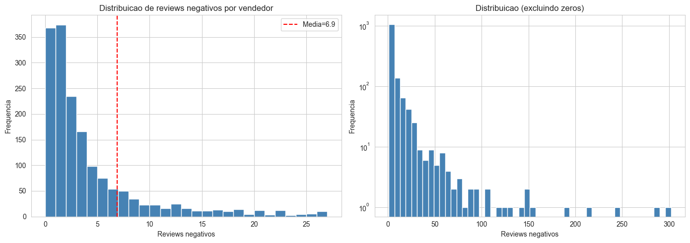
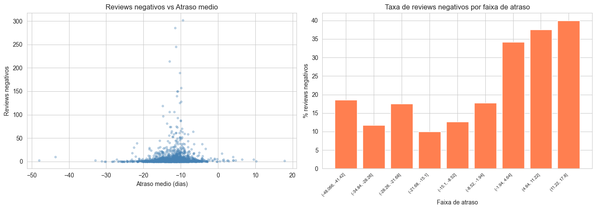
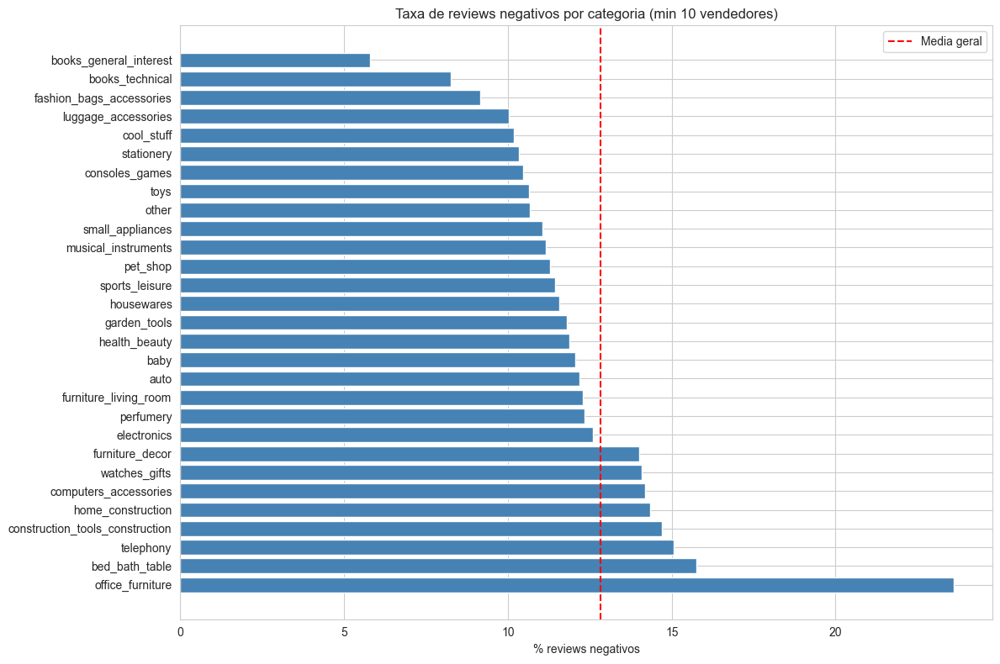
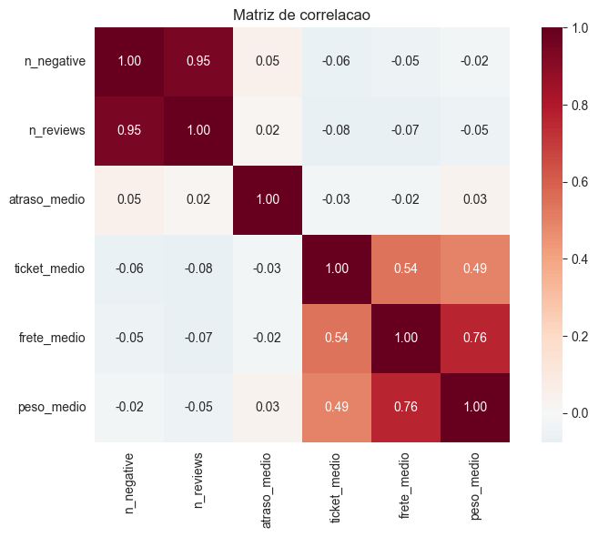
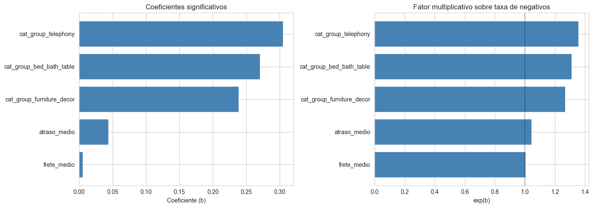
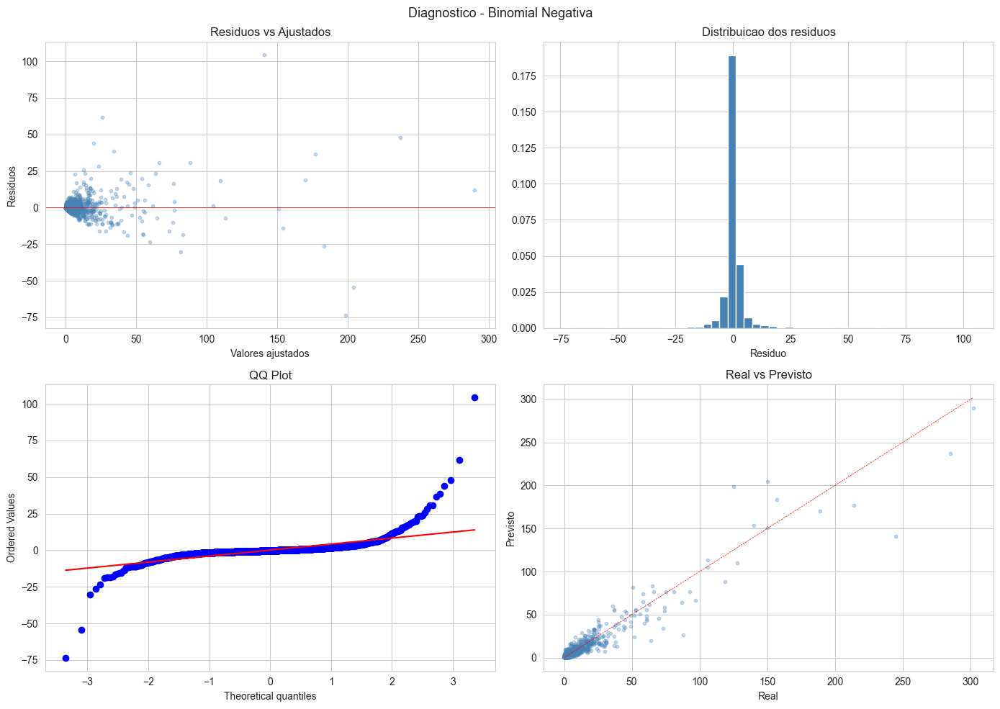

# Determinantes da Insatisfação no E-commerce

**Modelagem preditiva aplicada à base logística da Olist para identificar e quantificar os fatores que geram avaliações negativas no e-commerce brasileiro.**

> MBA em Data Science e Analytics — USP/ESALQ  
> Autor: [Maycon Aranha](https://www.linkedin.com/in/maycon-aranha/)  
> Dataset: [Olist Brazilian E-Commerce — Kaggle](https://www.kaggle.com/datasets/olistbr/brazilian-ecommerce)

---

## Resultados Principais

| Variável | IRR | Efeito | p-valor |
| :--- | :---: | :--- | :---: |
| Atraso médio na entrega (dias) | 1,0445 | +4,45% por dia | < 0,001 |
| Frete médio (R$) | 1,0054 | +0,54% por R$ 1 | < 0,001 |
| Categoria: Telefonia | 1,3568 | +35,7% | < 0,001 |
| Categoria: Cama/Mesa/Banho | 1,3108 | +31,1% | < 0,001 |
| Categoria: Móveis e Decoração | 1,2696 | +27,0% | < 0,001 |

> **IRR** = Incidence Rate Ratio = exp(β). Representa o fator multiplicativo sobre a taxa de avaliações negativas, mantidas as demais variáveis constantes.

---

## Metodologia

### Por que Regressão Binomial Negativa?

Avaliações de clientes são dados de contagem — inteiros não negativos com distribuição assimétrica à direita. O modelo de Poisson, alternativa mais simples, exige **equidispersão** (Variância = Média), condição sistematicamente violada em dados de satisfação.

**Diagnóstico de sobredispersão:**

| Teste | Estatística | Resultado |
| :--- | :--- | :--- |
| Cameron-Trivedi | t = 6,295 (p < 0,001) | Sobredispersão confirmada |
| Pearson χ²/df — Poisson | 1,789 | Ajuste inadequado |
| Pearson χ²/df — BN Reduzido | 1,061 | Ajuste adequado |
| Parâmetro α (BN) | 0,1147 | Dispersão estimada |

### Offset de Exposição

O modelo inclui `log(n_reviews)` como offset, normalizando a análise pela exposição de cada vendedor. Isso permite modelar a **taxa de insatisfação** — não o volume bruto — entre vendedores com perfis de transação distintos.

### Seleção do Modelo Final

Partindo de um modelo completo com 29 variáveis (estados, categorias, métricas operacionais), o modelo reduzido foi selecionado por critério AIC com VIF < 5 para todos os preditores.

| Critério | Poisson | BN Reduzido |
| :--- | :---: | :---: |
| AIC | 7.488,7 | **6.983,0** |
| BIC | 7.647,3 | **7.015,8** |
| Nº de parâmetros | 29 | **6** |
| LR Test vs Poisson | — | χ² = 492,0 (p < 0,001) |

---

## Análise Exploratória

### Distribuição da variável resposta

A distribuição de reviews negativos por vendedor apresenta forte assimetria à direita — padrão típico de sobredispersão — que inviabiliza o uso direto do modelo de Poisson.



### Atraso e insatisfação

A relação entre atraso médio de entrega e volume de reviews negativos evidencia que entregas acima do prazo concentram os maiores volumes de insatisfação.



### Taxa de insatisfação por categoria

Categorias como `bed_bath_table`, `telephony` e `office_furniture` apresentam taxas de reviews negativos consistentemente acima da média geral, sinalizando sensibilidade específica além da logística.



### Matriz de correlação

A matriz evidencia que `atraso_medio` é a variável com maior correlação direta com `n_negative`, enquanto variáveis de valor do pedido (`ticket_medio`, `frete_medio`, `peso_medio`) apresentam correlações entre si mas baixa correlação direta com a variável resposta.



---

## Resultados do Modelo

### Coeficientes e IRR

O gráfico à esquerda mostra os coeficientes β estimados. O gráfico à direita apresenta os **IRR = exp(β)**, interpretados como o fator multiplicativo sobre a taxa de insatisfação — a escala mais direta para comunicar o efeito de cada variável.



### Diagnóstico do modelo

Os quatro painéis confirmam a adequação do modelo Binomial Negativo: resíduos centrados em zero sem padrão sistemático, distribuição aproximadamente simétrica e alinhamento razoável no QQ-plot para a região central da distribuição.



---

## Estrutura do Repositório

```
.
├── notebooks/
│   ├── 01_preparacao.ipynb        # ETL e engenharia de atributos
│   ├── 02_eda.ipynb               # Análise exploratória e visualizações
│   ├── 03_modelagem.ipynb         # Ajuste e seleção do modelo NB2
│   └── 04_interpretacao.ipynb     # Diagnóstico, IRR e insights finais
├── outputs/
│   ├── coeficientes_negbin.csv    # Coeficientes, std, z, p-valor e IRR
│   ├── metricas_modelos.json      # AIC, BIC, LLF, testes estatísticos
│   └── *.png                      # Gráficos gerados pelos notebooks
├── data/                          # Dataset consolidado por vendedor
├── requirements.txt               # Dependências do projeto
└── .gitignore
```

## Como Executar

```bash
git clone https://github.com/mayconaranha/ecommerce-satisfaction-study.git
cd ecommerce-satisfaction-study
pip install -r requirements.txt
```

Execute os notebooks na ordem numérica (`01` → `04`). O dataset consolidado já está incluso em `data/` para execução imediata do modelo.
